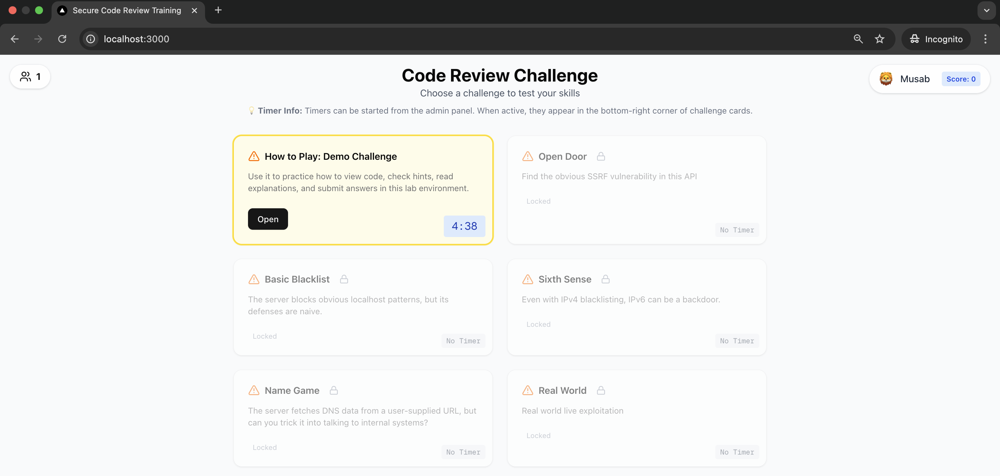

# Code Review Challenge Platform

> **Developed by:** Musab Khan & Shaz Syed  
> **Purpose:** Internal security training and code review practice  
> **⚠️  Note:** This application is designed for educational purposes and is not intended for production environments.

A web-based platform for code review training challenges with real-time user tracking and leaderboard functionality.

## Screenshots

### Main Interface


### Admin Panel


### Leaderboard


## Demo Video

https://github.com/imusabkhan/code_review_training/assets/123456789/demo.mp4

## Quick Start with Docker

### Option 1: Pull from Docker Hub
```bash
docker pull imusabkhan/code-review-training:latest
docker run -d --name code_review_training -p 3000:3000 -p 4001:4001 imusabkhan/code-review-training:latest
```

### Option 2: Build and Run Locally
```bash
# Build the image
docker build -t code-review-training .

# Run the container
docker run -d --name code_review_training -p 3000:3000 -p 4001:4001 code-review-training
```

### Access the Application
- **Main App**: http://localhost:3000
- **Socket.IO Server**: http://localhost:4001

## Local Development Setup

### Prerequisites
- Node.js 18+
- npm or yarn
- Git

### Installation
```bash
# Clone the repository
git clone https://github.com/imusabkhan/code_review_training.git
cd code_review_training

# Install dependencies
npm install

# Create environment file
echo 'DATABASE_URL="file:./prisma/dev.db"' > .env.local

# Set up database
npx prisma generate

# Windows
$env:DATABASE_URL="file:./prisma/dev.db"; npx prisma db push

# Linux/macOS:
DATABASE_URL="file:./prisma/dev.db" npx prisma db push

# Start development server
npm run dev
```

## Features

- **Code Review Challenges**: Interactive challenges with vulnerability detection
- **Real-time User Tracking**: Live user count and challenge timers
- **Leaderboard System**: Track user scores and rankings
- **Admin Panel**: Manage challenges and monitor submissions
- **Flag Submission**: Secure flag validation system

## Tech Stack

- **Frontend**: Next.js 15, React 19, TypeScript, Tailwind CSS
- **Backend**: Next.js API Routes, Prisma ORM, SQLite
- **Real-time**: Socket.IO
- **Authentication**: Iron Session (admin)
- **Styling**: Radix UI components


## Docker Commands

```bash
# Build image
docker build -t code-review-training .

# Run container
docker run -d --name code_review_training -p 3000:3000 -p 4001:4001 code-review-training

# View logs
docker logs code_review_training

# Stop container
docker stop code_review_training

# Remove container
docker rm code_review_training
```

## Admin Access

- **URL**: http://localhost:3000/admin
- **Username**: admin
- **Password**: admin123

## License

MIT License
